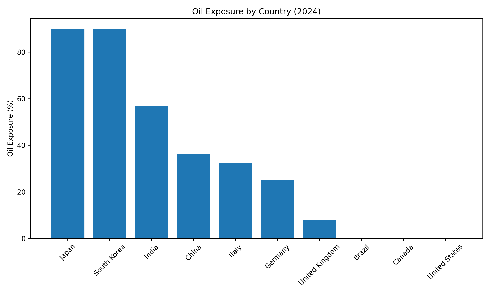
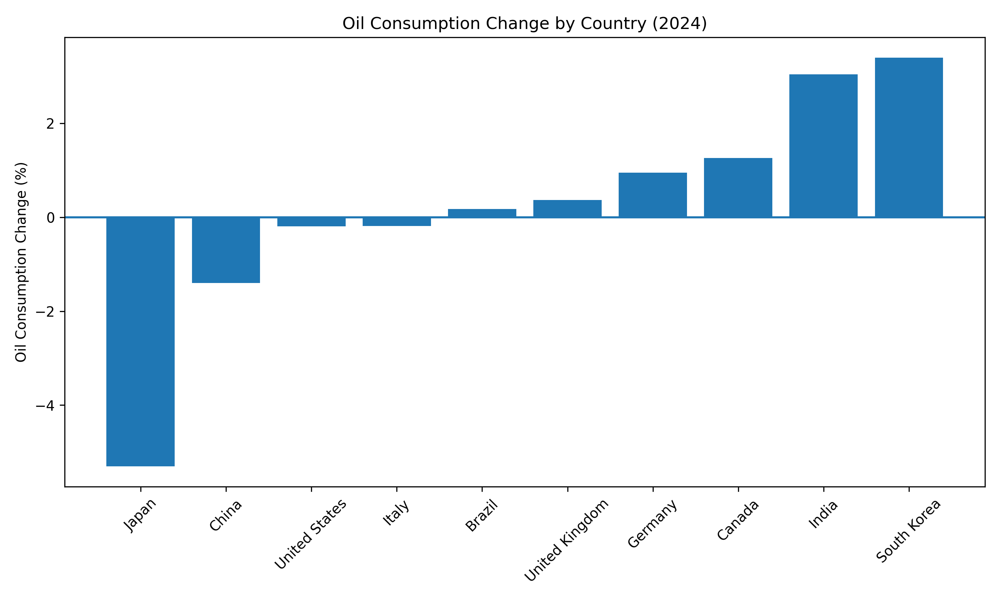
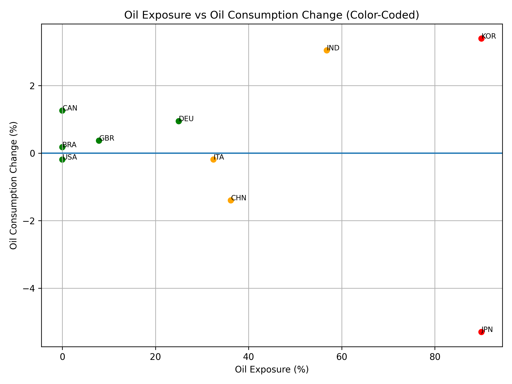

# The Energy Security Gap: Oil Chokepoint Exposure, Strategic Reserves, and Short-Term Response
> A data analysis project examining how oil-dependent countries respond to supply risk through reserves, demand changes, and energy transition signals. 

---

## Project Overview
In February 2026, a major conflict in the Middle East led to the near-total closure of the Strait of Hormuz, disrupting approximately 20% of the global oil supply. This event highlighted the vulnerability of countries heavily dependent on imported oil and exposed gaps in global energy resilience.

This project evaluates the **“Energy Security Gap”**—the difference between a country’s exposure to oil supply disruptions and its ability to respond through strategic reserves and short-term behavioral adjustments. Using 2023–2024 national energy data as a proxy for pre-crisis conditions, the analysis focuses on structural vulnerability and response capacity across major economies.

This project examines whether countries with higher oil exposure demonstrate stronger short-term resilience behaviors, including reductions in oil consumption or reliance on strategic reserves.

---

## Summary of Insights

* Oil exposure is highly concentrated in a small number of countries, particularly in East Asia.
* High exposure does not consistently lead to reduced oil consumption.
* Strategic reserves are the primary short-term response mechanism for high-risk countries.
* No clear relationship exists between oil exposure and renewable growth in the short term.

---

## Research Question
> **How does structural dependence on oil imports influence a country's short-term energy response and resilience capacity?**

### Secondary Questions
* **Buffer Analysis:** Do countries with higher oil exposure maintain larger Strategic Petroleum Reserves (SPR)?
* **Behavioral Response:** Do highly exposed countries reduce oil consumption more than less exposed countries?
* **Transition Signal:** Is there any relationship between oil exposure and renewable energy growth?

---

## Variables Analyzed
* **Oil Exposure (%):** Estimated share of national oil consumption dependent on imports vulnerable to Middle Eastern supply disruptions.
* **Strategic Reserve Coverage (SPR Days):** Number of days a country can sustain oil demand using stored reserves.
* **Renewable Growth (%):** Year-over-year change in renewable electricity generation.
* **Oil Consumption Change (%):** Short-term change in national oil demand.

---

## Data Sources
* **Our World in Data (OWID):** Renewable electricity generation and oil consumption data.
* **Energy Institute (Statistical Review):** Oil production and consumption data.
* **IEA (Secondary Reference):** Contextual information on oil markets and strategic reserves.

---

## Tools Used
* **SQL:** Data modeling, filtering, and grouping for exposure and behavior analysis.
* **Python (Pandas, Matplotlib):** Data cleaning and visualization (scatter plots, bar charts).
* **GitHub:** Documentation and version control.

--- 

## Analysis Plan

1. Clean and structure national energy data using SQL and Python.
2. Calculate oil exposure, estimated imports, and demand changes.
3. Group countries by exposure level to identify patterns.
4. Visualize relationships between exposure, oil demand, and reserve capacity.
5. Interpret whether exposure drives short-term behavioral or structural change.

---

## Key Visualizations

### Oil Exposure by Country


### Oil Consumption Change by Country


### Exposure vs Oil Demand (Scatter)


---

## Key Findings
> The following findings summarize patterns observed across the SQL and Python analysis:

1. **Oil Exposure is Highly Concentrated**
   - Countries such as Japan and South Korea show extremely high exposure (~90%), while the United States, Canada, and Brazil exhibit near-zero exposure due to domestic production.

2. **High Exposure Does Not Guarantee Demand Reduction**
   - Japan significantly reduced oil consumption (~-5%), but other highly exposed countries like India and South Korea increased consumption.
   - This suggests that exposure alone does not drive immediate behavioral change.

3. **Weak Relationship Between Exposure and Behavior**
   - Scatter plot analysis shows no consistent correlation between oil exposure and short-term changes in oil demand.
   - Countries respond differently based on internal economic structure, not just external risk.

4. **Strategic Reserves Play a Critical Role**
   - Highly exposed countries (Japan, South Korea) maintain large strategic reserves, indicating reliance on stored capacity rather than rapid demand reduction.

5. **Short-Term Response Favors Stability Over Transition**
   - Countries primarily rely on existing infrastructure (reserves and supply chains) rather than accelerating renewable energy adoption in the immediate term.

---

## Limitations

* The analysis uses 2023–2024 data as a proxy for crisis conditions rather than real-time 2026 data.
* Renewable growth is measured annually and may not reflect short-term crisis response.
* Oil exposure is estimated and may not capture all supply chain complexities.
* The analysis focuses on a small set of major economies and may not generalize to all countries.

---

## Recommendations

1. **Increase Strategic Reserve Capacity in High-Exposure Countries**
   - Countries with high import dependence but low reserve coverage (e.g., India) remain highly vulnerable.

2. **Diversify Energy Supply Chains**
   - Reducing reliance on single-region imports can significantly improve resilience.

3. **Invest in Long-Term Renewable Infrastructure**
   - While renewables do not provide immediate crisis response, they reduce structural vulnerability over time.

4. **Develop Rapid Demand-Response Policies**
   - Behavioral and policy tools (e.g., fuel restrictions, efficiency measures) are necessary to complement physical reserves.

5. **Align Crisis Planning with Energy Transition Goals**
   - Current responses prioritize stability, but future strategies should integrate both resilience and decarbonization.

---

## Repository Structure
```text
├── data/               # Raw datasets from IEA, OWID, and World Bank
├── cleaned/            # Data that has been processed via SQL/Python
├── analysis/           # SQL scripts and Jupyter Notebooks (.ipynb)
├── visualizations/     # Exported charts, maps, and PNGs
├── report/             # Final summary of findings and policy insights
└── README.md           # Project documentation
```

---

## Purpose of the Project
This project is part of my transition from Psychology to Data Analytics, applying behavioral and data-driven approaches to understand how countries respond to systemic risk and uncertainty.

---

## Author
Arshalisha Abellera

_Junior Data Analyst_
